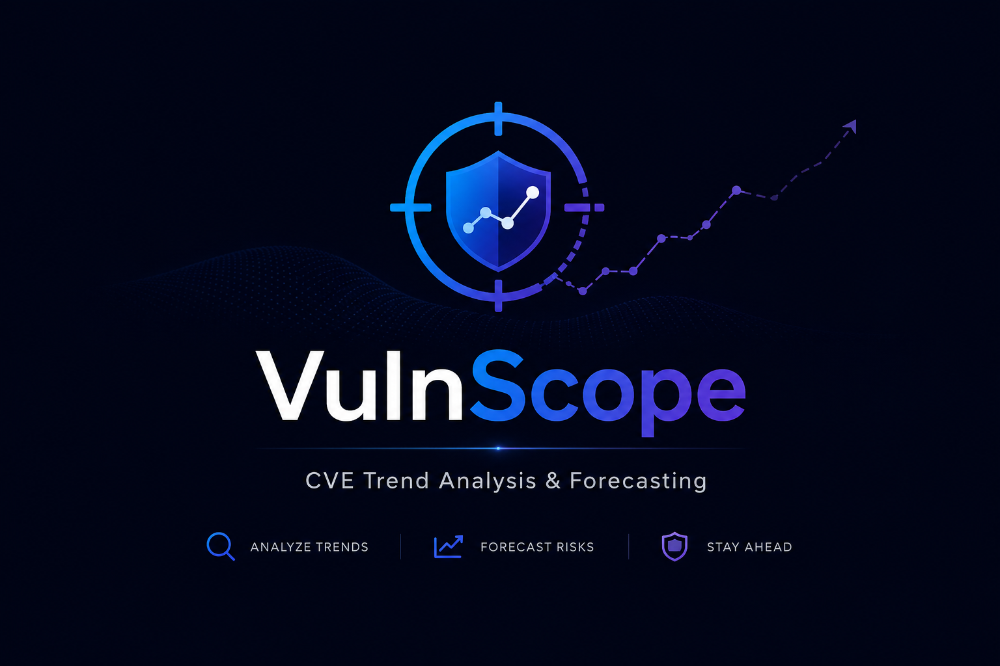

# VulnScope: CVE Trend Analysis and Future Risk Forecasting

<p align="center">
  
</p>


A research-grade machine learning pipeline that analyses 10+ years of vulnerability
data from the NVD to identify recurring weaknesses, measure trends, and forecast
which CVE categories pose the greatest emerging risk.

## Research Question

> Which vulnerability categories recur over time, how are their patterns changing,
> and which pose the greatest predicted risk in the coming year?

## Workflow: Three Commands

```
python main.py fetch      # one-time: download CVEs from NVD into SQLite

python main.py build      # trend analysis + feature engineering + train + evaluate

python main.py predict    # offline: forecast next year's emerging threats
```

## ML Models

| Model | Task | Method | Target |
|---|---|---|---|
| Linear Regression | Volume forecasting | Lagged count regression | Next year's CVE count per CWE |
| Logistic Regression | Emerging threat detection | Binary classification | Will this CWE surge >50%? |
| Random Forest | Risk tier classification | Multi-class (4 tiers) | LOW / MEDIUM / HIGH / CRITICAL |

### Feature Engineering
 
Unit of analysis: one row per (year, CWE) pair. Each row is built from three
years of lagged history for that CWE, so the earliest usable training year is
the fourth year in the dataset.
 
| Feature | Description |
|---|---|
| count_t, count_lag1–3 | CVE count in current year and three prior years |
| growth_1y, growth_3y | Year-over-year and 3-year compound growth rates |
| accel | Change in growth rate (second derivative of count) |
| volatility | Std dev of count over the three prior years |
| momentum | count_t × growth_1y — size-adjusted trend signal |
| avg_score | Mean CVSS base score for this (year, CWE) pair |
| pct_critical, pct_high | Fraction of CVEs at CRITICAL and HIGH severity |
| pct_network, pct_no_auth | Fraction that are network-exploitable / require no privileges |
| year_norm | year − min_year — lets models detect long-run secular trends |
| sc_category_* | One-hot indicator for the five supply-chain categories above |

### Temporal Split. No Leakage

Training uses all data before 2023. Test uses 2023 onwards. This mirrors production
use: the model is trained on historical data and evaluated on data it has never seen.

## Outputs

**Trend analysis charts** (`results/figures/`):
- CVE volume by year
- Top CWEs by lifetime volume
- CWE growth trends over time (top 6)
- Severity distribution by year
- Attack vector share over time

**Text report** (`results/analysis_report.txt`):
recurring vulnerabilities, fastest growing CWEs, declining CWEs, recent severity trends.

**ML evaluation** (`results/figures/eval_*.png` + `results/metrics/metrics.json`):
LR forecast accuracy, LogReg ROC for surge detection, RF confusion matrix, SHAP explainability.

**Threat forecast** (`python main.py predict`):
Ranked list of emerging, persistent, and declining CWE categories for the next year.

## Installation

```
git clone https://github.com/macbuildssys/vulnscope.git

cd vulnscope

python -m venv .venv && source .venv/bin/activate

pip install -r requirements.txt
```

## Usage

### Full pipeline with real NVD data

```
# Set up NVD API key (free, speeds up download significantly)
python main.py init

# Download ~262 000 CVEs (3-5 minutes with API key)
python main.py fetch

# Trend analysis + train + evaluate
python main.py build

# Forecast emerging threats for next year
python main.py predict

# Check what is in the database
python main.py db-status
```

### Demo mode (no network, synthetic data)

```
python main.py demo
```

### Example predict output

```json
{
  "forecast_year": 2026,
  "top_emerging_threats": [
    {
      "cwe": "CWE-502",
      "predicted_count": 542,
      "surge_probability": 0.91,
      "risk_tier": "HIGH",
      "growth_1y": 0.38,
      "avg_score": 8.1
    }
  ],
  "summary": {
    "critical_risk_cwes": 4,
    "surge_candidates": 7
  }
}
```

## Limitations and Next Steps

- CVSS v4 data not yet included (NVD is actively scoring CVEs under v4; extending the parser is a near-term TODO).
- Text features from CVE descriptions are not used. TF-IDF or SecBERT embeddings would add signal beyond the structured CVSS vector.
- The panel dataset is relatively small (one row per year-CWE pair). Richer aggregation (e.g. by vendor, product family, or CWE sub-category) would increase the number of observations.
- EPSS (Exploit Prediction Scoring System) scores could be joined as an additional feature to capture exploitability beyond the CVSS severity rating.


## Data Source

NVD API 2.0: https://services.nvd.nist.gov/rest/json/cves/2.0

NVD data is in the public domain. 

## License

Distributed under the MIT License. See [LICENSE](LICENSE)